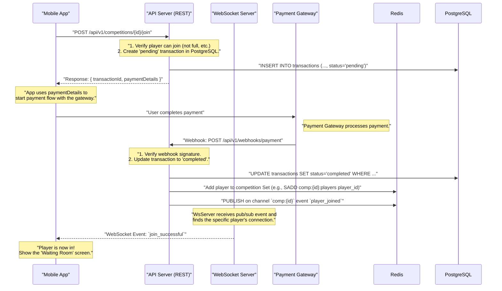

# Player API: Joining a Competition

This document outlines the complete, end-to-end flow for a player joining a competition that requires an entry fee. The process is designed to be secure, transactional, and provide instant feedback to the player using a combination of REST APIs and WebSockets.

## High-Level Process Flow

The flow ensures a player's entry is only confirmed after a successful payment. It begins with a REST API call to signal intent, proceeds to payment, and finishes with a WebSocket event to confirm entry and update the UI in real-time.



## Detailed Step-by-Step API Flow

### Phase 1: Initiate Joining Process (REST API)

This phase is handled via a standard, secure REST API call to ensure the transactional integrity of the payment initiation.

1.  **Endpoint**: `POST /api/v1/competitions/{competitionId}/join`
2.  **Description**: A player signals their intent to join a specific competition.
3.  **Authentication**: Required (e.g., JWT Bearer Token).
4.  **Server-Side Logic**:
    -   Verify that the player is authenticated.
    -   Check business rules: Is the competition in the `open` state? Is it not full? Has the player already joined?
    -   Create a record in the `transactions` table with a `status` of `pending`. This record links the `playerId`, `competitionId`, and `entry_fee`.
    -   Generate the necessary details for the mobile app to communicate with the payment gateway (e.g., a one-time payment token, a URL, etc.).
5.  **Success Response (200 OK)**:
    ```json
    {
        "transactionId": "txn_f8e1d2c3",
        "paymentDetails": {
            //... gateway-specific details
        }
    }
    ```
6.  **Error Responses**:
    -   `401 Unauthorized`: Invalid or missing auth token.
    -   `404 Not Found`: `competitionId` does not exist.
    -   `403 Forbidden`: Competition is not open for registration (e.g., it's full, already started, or not yet open).

### Phase 2: Payment Confirmation (Webhook)

This phase is handled by a server-to-server webhook from the payment gateway. This is the source of truth for a completed payment.

1.  **Endpoint**: `POST /api/v1/webhooks/payment-gateway`
2.  **Description**: The payment gateway notifies the backend of the payment status.
3.  **Security**: The endpoint **must** verify the signature of the incoming webhook to ensure it originates from the payment gateway. This is a critical security measure.
4.  **Server-Side Logic**:
    -   Parse the webhook payload to identify the transaction.
    -   Verify the payment was successful.
    -   Find the corresponding transaction in the `transactions` table (using the `transactionId` or another identifier) and update its `status` from `pending` to `completed`.
    -   If the transaction is successfully updated, proceed to the finalization step.
5.  **Response**: The server should respond with a `200 OK` to the webhook to acknowledge receipt. Any other status code may cause the gateway to retry the webhook.

### Phase 3: Finalize Entry & Notify Player (Redis & WebSockets)

After a confirmed payment, the system finalizes the player's entry and provides instant feedback.

1.  **Trigger**: This logic runs immediately after the transaction status is updated to `completed` in the step above.
2.  **Server-Side Logic**:
    -   **Add Player to Set**: The player's ID is officially added to the Redis Set that tracks all confirmed participants for that competition (e.g., `SADD competitions:{competitionId}:players {playerId}`). This provides a fast, atomic way to manage the roster.
    -   **Publish Event**: The server publishes a `player_joined` event to a competition-specific Redis Pub/Sub channel (e.g., `PUBLISH competition:{competitionId} '{"event": "player_joined", "playerId": "..."}'`).
3.  **Real-time Notification (WebSocket Push)**:
    -   All API/WebSocket servers are subscribed to the Redis Pub/Sub channels. Upon receiving the `player_joined` message, the relevant server instance finds the specific player's WebSocket connection.
    -   It pushes a confirmation event directly to that player's mobile app.
    -   **Event (Server → Client)**: `join_successful`
    -   **Payload**:
        ```json
        {
            "competitionId": "comp_123",
            "message": "Payment successful! You are in. The competition will start soon."
        }
        ```
4.  **Client-Side Logic**:
    -   Upon receiving the `join_successful` event, the mobile app transitions the user to the "Waiting Room" UI, where they wait for the competition to begin.
